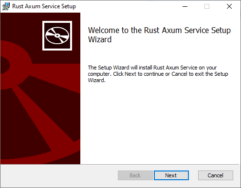
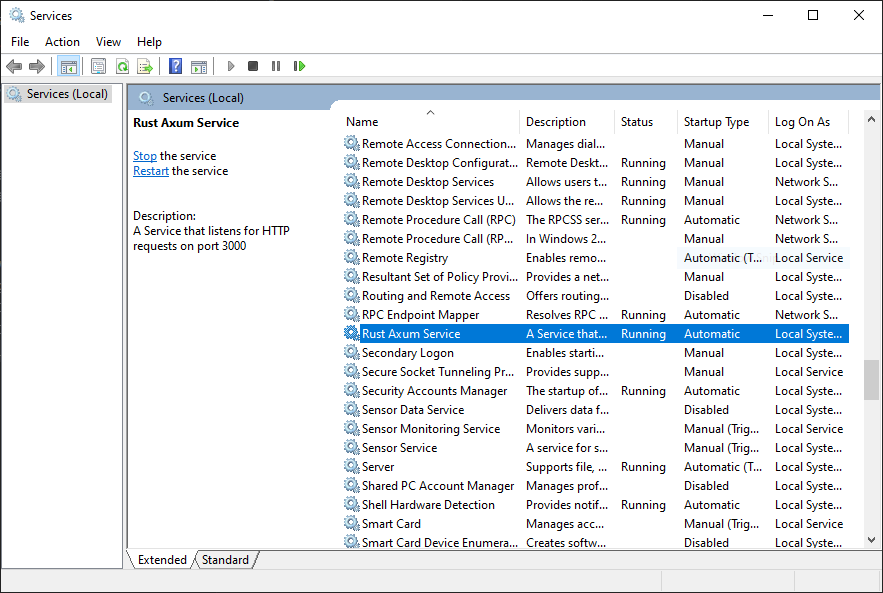
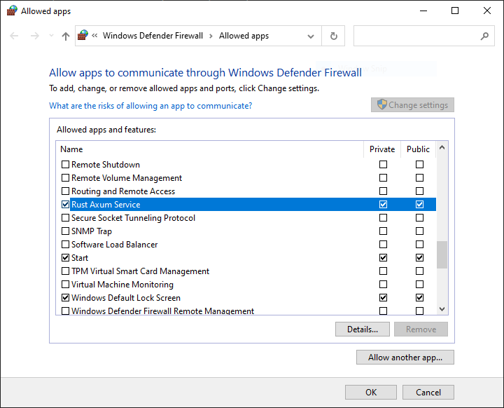
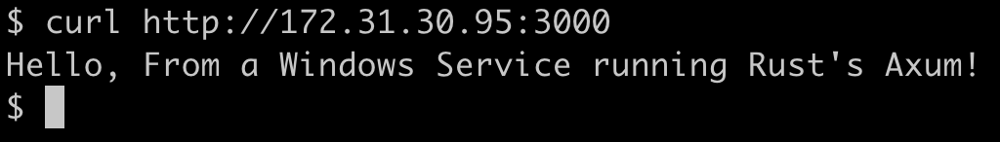

# Rust Axum as a Windows Service
This is a simple example of how to run a Rust Axum web server as a Windows service using [windows_service](https://docs.rs/windows-service/latest/windows_service/) and have an MSI installer created using [cargo_wix](https://volks73.github.io/cargo-wix/cargo_wix/).

## My Setup
- Windows Server 2022
- Rust (Installed by first downloading and installing the [Microsoft C++ build tools](https://visualstudio.microsoft.com/visual-cpp-build-tools/), then downloading running `RUSTUP-INIT.exe`)
- [WiX Toolset 3.14.1](https://github.com/wixtoolset/wix3/releases/tag/wix3141rtm)
- `cargo-wix` (Installed by running `cargo install cargo-wix`)

## Building the MSI Installer
Run `cargo wix -C -ext -C WixFirewallExtension -L -ext -L WixFirewallExtension` in the root of the project. This will create an MSI installer in the `target\wix` directory.

The `-C -ext -C WixFirewallExtension -L -ext -L WixFirewallExtension` flags are required to include the WiX Firewall Extension in the MSI installer. This is needed to add a firewall rule to allow incoming traffic on the port the web server is running on.

Both `-C` and `-L` flags are required to include the extension in the compiler `light.exe` and the linker `candle.exe`.

## Installing the MSI Installer
Run the MSI installer created in the `target\wix` directory. The installer will install the service and start it. The service will be set to start automatically on boot.

## My Results
First page of the installer:\

Service installed and running:\

Firewall rule added:\

Using `curl` to test the web server from another machine:\

## Errata
I created this project out of a quick need to have a web server running as a Windows service. I spend most of my time in Linux, and this got me up and running quickly. If there are any issues or improvements, please let me know. I would be happy to update this project. Meanwhile, I hope this helps others who want to play in the Rust / Windows Service world.